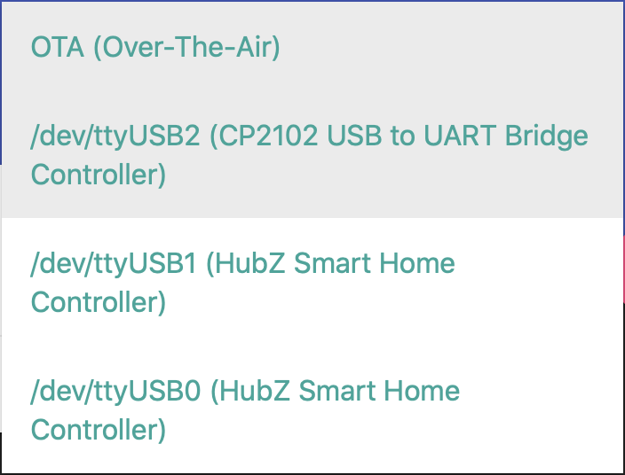
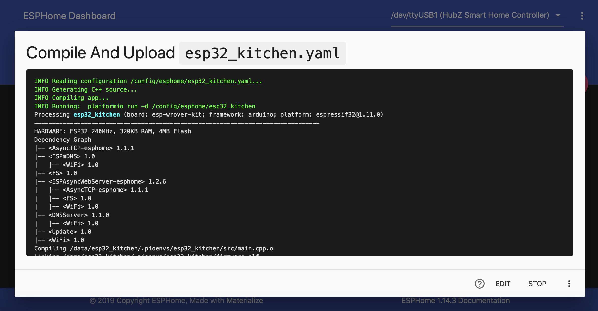
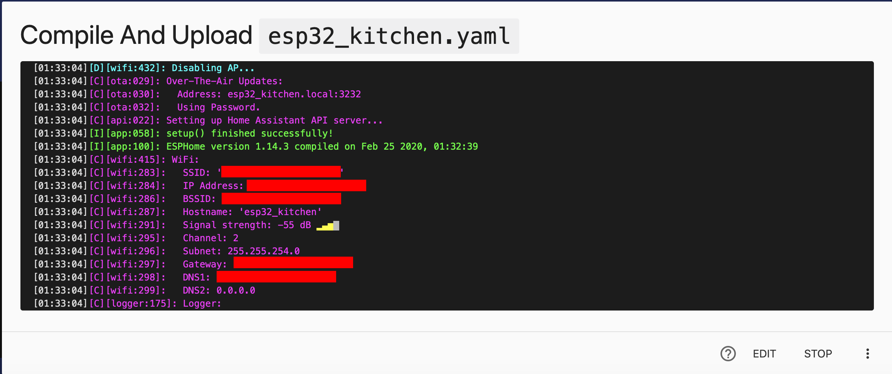

# ESPHOME

ESP32 (successor of ESP8266) is a low cost, low power system on chip (SoC) which you can use to make your own Home Assistant sensors, cameras, and more.

ESPHome makes it easy to program these chips and integrate them into Home Assistant.

## Installing ESPHome

1. Click `Supervisor | Add-on Store` and then add the ESPHome repository:
https://github.com/esphome/hassio
1. Search for and install the `ESPHome` add-on
2. Click `show in sidebar` and then `Start`

## Initializing the ESP32
1. Connect the ESP32 to your Home Assistant's USB port
> NOTE: My ESP32 was not accessible connecting to my Intel NUC's USB ports.
2. Restart the ESPHome add-on
3. Click on the sidebar ESPHome icon
4. Click `Setup your first node`, type a name (ex. esp32_kitchen), and then `continue`
5. Set device type to `Generic ESP32 (WROVER Module)`
6. Provide your SSID and password
7. Create and provide an access password
8. Click `Continue` and select an upload port (i.e. the USB port you plugged the ESP32 into, ex. /dev/tty/USB2).

9.  Click `Upload`

1.  Click `Stop` after reviewing the logs for a successful completion and network connectivity.

11. Your ESP32 should display as "Online"

## Adding the ESP32 to Home Assistant

1. Open Home Assistant
2. Click `Configuration | Integrations`
3. Click `Configure` on your discovered ESP32

> NOTE: If your device does not display as discovered after 5 minutes, you can manually add it by clicking the bottom right plus sign.
4. Click `Submit` when prompted
5. Provide your password and click finish

You can now disconnect your ESP32 from your Home Assistant's USB port and plug it into a USB power adapter (it will wirelessly talk to Home Assistant).

***

[Previous](introduction.md) | [Next](sensor-build.md) |
[Table of Contents](../README.md#table-of-contents)