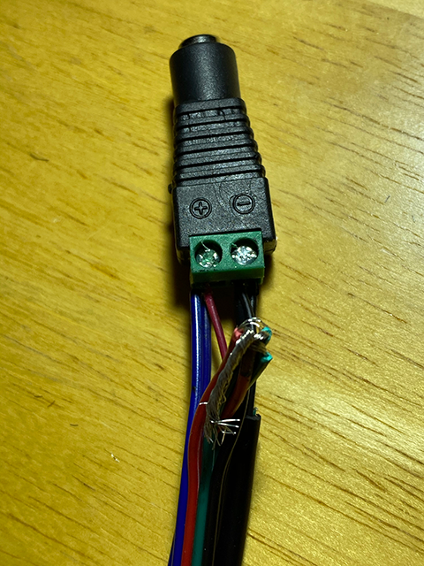

# SENSOR: BUILD

## Tools Needed
To minimize the assembly time, skill level, and tooling required, you will only need a pair of scissors and electrical tape (to strip and secure wires/connections).  If you have experience, tools, and time, you can choose to solder and or crimp connections instead.

## LED Strip

<table><tr><td>Step</td><td>Illustrations</td></tr>
<tr><td><ul><li>Cut off the USB Type A connector</li><li>Strip back the shield, exposing the 4 inner wires</li><li>Cut off the white and green wires</li><li>Strip back the shield on the red (+5V) and black (GND) wires</li></ul></td><td></td></tr>
<tr><td><ul><li>Determine your desired strip length</li><li>Cut along the copper contacts</li></ul></td><td></td></tr>
 <tr><td><ul><li>Open the connector</li><li>Slide the cut strip into the connector and under the contacts</li><li>Ensure correct contact to wire placement (5V=blue wire, BI=red wire, DI=green wire, GND=black wire)</li><li>Close the connector</li></ul></td><td></td></tr>
<tr><td><ul><li>Strip all 4 wires on the connector and on a 4 foot, 4 wire extension cable</li><li>Connect the connector's and extension's red and green wires all together (these are for data redudancy)</li><li>Connect the connector's and extension's blue wires to the USB red wire</li><li>Connect the connector's and extension's black wires to the USB black wire</li></ul></td><td></td></tr>
<tr><td><ul><li>Insert the blue/red wire bundle into the power plug's positive (+) terminal and screw secure</li><li>Insert the black wire bundle into the power plug's negative (-) terminal and screw secure</li></ul></td><td></td></tr>
<tr><td><ul><li>Tape up the green/red bundle and then the wires connecting to the plug</li><li>Tape around the plug and all wires</li></ul></td><td></td></tr>
<tr><td><ul><li>Strip the black, green, and red wires on the other end of the extension cable</li><li>Strip the end of 2 female dupont connector wires</li></ul></td><td></td></tr>
<tr><td><ul><li>Connect the black extension wire to one dupont wire and connect the red+green extension wires to the other dupont wire</li></ul></td><td></td></tr>
<tr><td><ul><li>Connect the black extension/dupont connector to ESP32 pin 2 (GND)</li><li>Connect the red+green extension/dupont connector to ESP32 pin 8 (GPIO05)</li></ul></td><td></td></tr></table>

## Human, Temperature, & Humidity Sensors

<table><tr><td>Step</td><td>Illustrations</td></tr>
<tr><td>Strip the end of 6 female dupont connetor wires</li></ul></td><td></td></tr>
<tr><td><ul><li>Connect and tape 3 stripped wires together; Connect 1 end to DHT22 positive(+), 1 to AM312 positive(+), and 1 to ESP32 pin 1 (3V)</li></ul></td><td></td></tr>
<tr><td><ul><li>Connect and tape the remaining 3 stripped wires together; Connect 1 end to DHT22 negative(-), 1 to AM312 negative(-), and 1 to ESP32 pin 2 (GND)</li></ul></td><td></td></tr>
<tr><td><ul><li>Connect a female dupont wire between DHT22 data pin and ESP32 pin 14 (GPIO22)</li></ul></td><td></td></tr>
<tr><td><ul><li>Connect a female dupont wire between AM312 data pin and ESP32 pin 11 (GPIO21)</li></ul></td><td></td></tr>
<tr><td><ul><li>Insert a 4.7k ohm resistor between the DHT22's positive(+) and data pins</li></ul></td><td></td></tr></table>

***

[Previous](esphome.md) | [Next](sensor-configure.md) |
[Table of Contents](../README.md#table-of-contents)