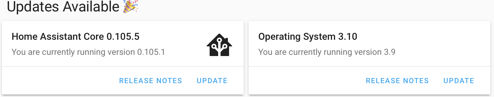
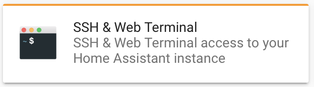
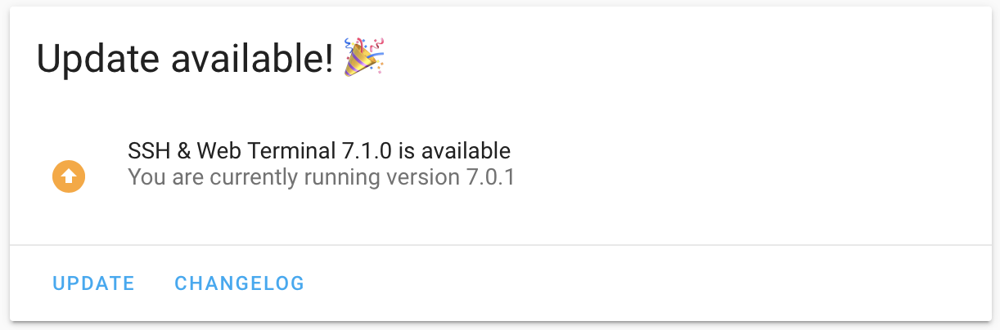

# SECURITY

- [Risks](#risks)
- [Securing Accounts](#securing-accounts)
  - [Strong Usernames & Passwords](#strong-usernames--passwords)
  - [Enable Multifactor Authentication](#enable-multifactor-authentication)
- [Securing the Server](#securing-the-server)
  - [IP Banning](#ip-banning)
- [Securing the Software](#securing-the-software)
  - [Update Prep](#update-prep)
  - [Updating Home Assistant Core & OS](#updating-home-assistant-core--os)
  - [Updating Add-ons](#updating-add-ons)
- [Securing Code](#securing-code)
  - [Keeping Secrets](#keeping-secrets)
- [Securing Communications](#securing-communications)
  - [Enabling SSL Encryption](#enabling-ssl-encryption)

## Risks

Risk | Description | Mitigation
--|--|--
Compromised Accounts | Attacker guesses your account name and password | [Use strong account names and passwords](security.md#strong-usernames--passwords); [Enable MFA per account](security.md#enable-multifactor-authentication); [Enable IP banning](security.md#ip-banning)
Compromised Software | Attacker exposes a vulnerability and controls your Home Assistant software | [Keep your software up to date](security.md#stay-current)
Compromised Server | Attacker exposes a vulnerability and controls the server Home Assistant runs on | Run Home Assistant on a dedicated server
Compromised Communications | Attacker intercepts and or modifies communciations | [Enable SSL encryption](#enabling-ssl-encryption)
Compromised Network | Attacker exposes a vulnerability and gains access to the network | Connect the server to a segregated network; Restrict inbouncd and outbound access
Compromised Devices | Attacker exposes a vulnerability and controls devices communicating with Home Assistant | Almost all mitigations mentioned above;

## Securing Accounts

### Strong Usernames & Passwords
Making both usernames and passwords unique and difficult to guess will help prevent others from accessing your accounts.  The tradeoff is that they will be harder to remember and enter.

When creating users:
- Set `name` to your desired `shortname` (ex. John)
- Set `username` to your `shortname_uniquename` (ex. John_Ct3cWPtQ)
    - You can generate unique usernames [here](https://www.lastpass.com/username-generator)
- Set `password` to a unique password (ex. u@VN$%SPn9UM)
    - You can generate unique passwords [here](https://www.lastpass.com/password-generator)
- Change the `Group` from `Administrators` to `User` (unless administrative access is required) 

### Enable Multifactor Authentication
For each account:
- Logon with the desired account
- Click on the account icon (bottom left)
- Click *Enable authenticator app*
- Scan the QR code displayed with your mobile authenticator app (ex. Google Authenticator)
- Type the code displayed in your mobile authenticator app

## Securing the Server

### IP Banning
To automatically ban IP addresses after x amount of failed login attempts, add the following to your `config/configuration.yaml`:

```yaml
http:
  ip_ban_enabled: true
  login_attempts_threshold: 5
```

## Securing the Software

Keep your Home Assistant software and its addons up to date to ensure your are running with the latest security fixes

### Update Prep
Before updating Home Assistant or its add-ons:
1. Take a snapshot - this allows you to rollback the update
2. Copy the snaphot off disk - incase the update corrupts everything
3. Read the release notes - updates make contain breaking changes

### Updating Home Assistant Core & OS

- Open Home Assistant
- Click Supervisor | Dashboard
- If there are any updates available, an `Updates Available` banner will appear withany updates listed below it.
  

- Follow the [Update Prep](#update-prep) instructions above
- Click `Update`

### Updating Add-ons

- Open Home Assistant
- Click Supervisor | Dashboard and click on any addons with a pending update (noted by the top colored bar)

- Follow the [Update Prep](#update-prep) instructions above
- Click `Update`


## Securing Code

### Keeping Secrets

Throughout your code, you'll need to reference sensitive data such as usernames, passwords, API keys, etc.  This is problematic as you may want to share your configuration with others, backup to Github, etc.  Luckily Home Assistant provides an easy way to redact secrets from your configuration files.  Click [here](https://www.home-assistant.io/docs/configuration/secrets/) to learn more.

## Securing Communications

### Enabling SSL Encryption
SSL encryption will secure communications betweeen the Home Assistant server and any connected clients.  Follow the instructions to setup SSL and remote access [here](remote-access.md#duck-dns--lets-encrypt).


***

[Previous](../installation/gui.md) | [Next](backups.md) |
[Table of Contents](../README.md#table-of-contents)