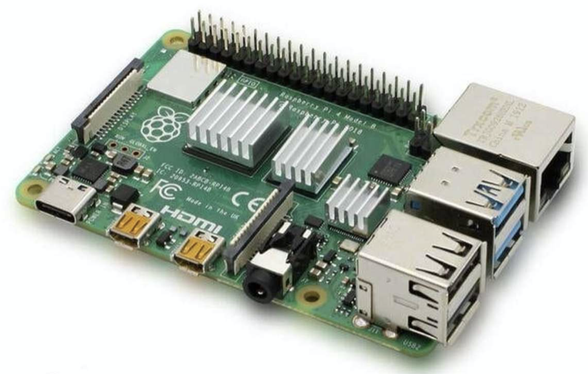
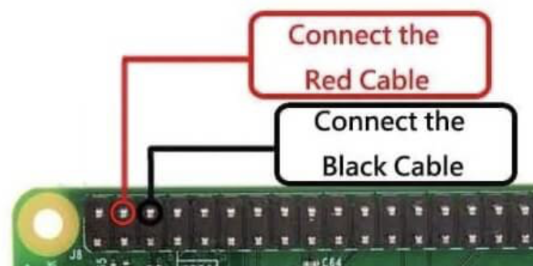
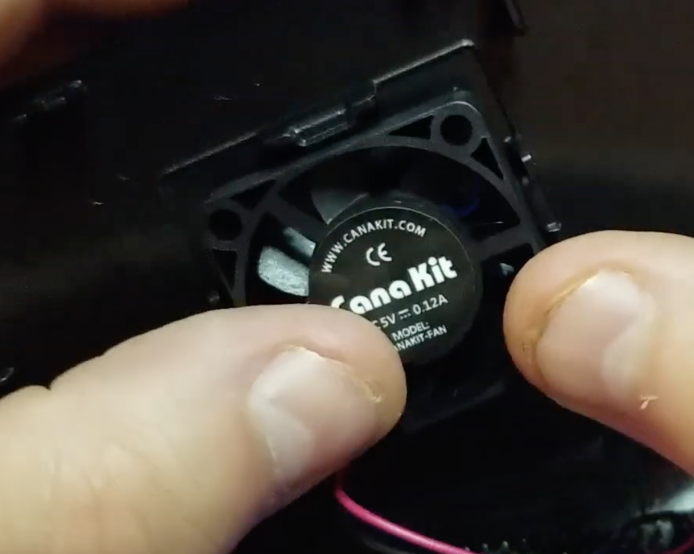
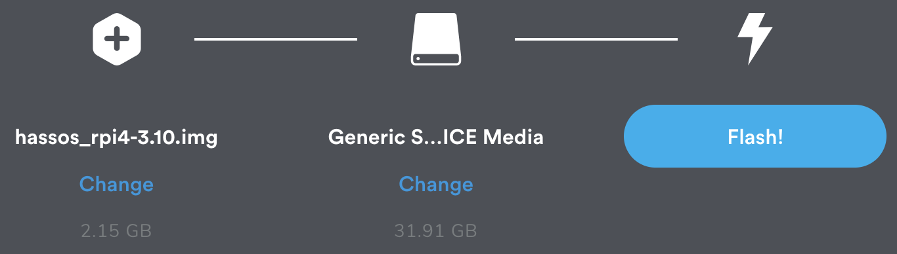
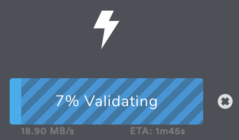
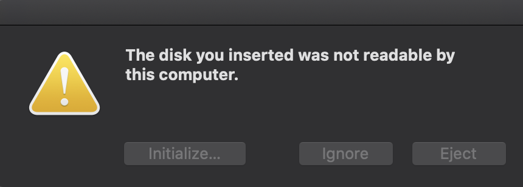
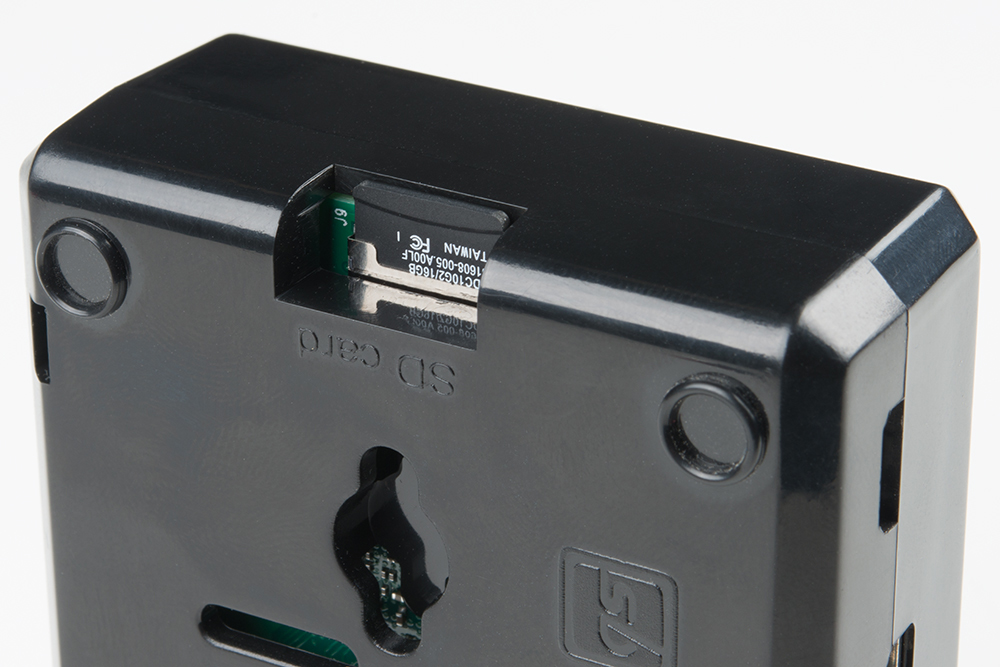
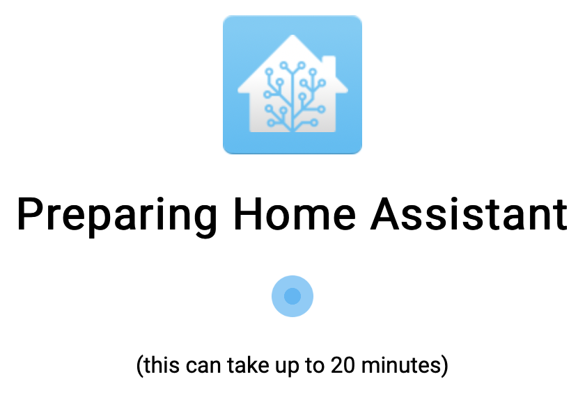

# INSTALLATION: PI

- [Building the Pi](#building-the-pi)
- [Prepping the Installation Media](#prepping-the-installation-media)
  - [Prepping a Wireless connection](#prepping-a-wireless-connection)
    - [Option 1: SD Card (Windows Only)](#option-1-sd-card-windows-only)
    - [Option 2: USB Stick (Windows or Mac)](#option-2-usb-stick-windows-or-mac)
  - [Resetting a Wireless connection](#resetting-a-wireless-connection)
- [Installing Home Assistant](#installing-home-assistant)
  - [Finding the PI's IP Address](#finding-the-pis-ip-address)
    - [On a Mac](#on-a-mac)

## Building the Pi
The following applies to a CanaKit Raspberry Pi 4 Kit:
1. Separate the case into its 3 parts (top, bottom, middle)
1. Align the Pi board on the bottom case panel
1. Attach the middle case panel to the bottom case panel
1. Attach the heat sinks:

1. Connect the fan to pins 4 (power/red) and 6 (ground/black) for 3.3v power

1. Attach the fan to the top case panel (fan logo/writing still visible)

1. Close the case by attaching the top case panel

## Prepping the Installation Media
1. Download the [32 bit image](https://www.home-assistant.io/hassio/installation/) for your Raspberry Pi version
> NOTE: Ensure the file extension is img.gz
2. Download and install [balenaEtcher](https://www.balena.io/etcher/)
3. Use balenaEtcher to flash the downloaded image to atleast a 32GB SD card

> TIP: You can cancel validation to save time


4. If your PI will use wireless networking (i.e. WIFI), follow the instructions below

> NOTE: On a Mac, ignore the final "not readable" error and click `eject`


### Prepping a Wireless connection

If your PI will use wireless networking (i.e. WIFI):

#### Option 1: SD Card (Windows Only)
1. [Prep the SD card as installation media](#prepping-the-installation-media)
2. Insert the SD card into a Windows system (does not work on a Mac)
3. On the SD card `hassos-boot` volume, create a TXT file `config\network\my-network` (with no file extension)
4. Paste the text from **my-network file contents** (see below) into the text file (replacing `SSID_NAME` and `SSID_PASSWORD` appropriately):

#### Option 2: USB Stick (Windows or Mac)
1. Format a USB stick with a single FAT32 (aka MS-DOS FAT on a Mac) parititon named `CONFIG`
2. In the `CONFIG` partititon, create a folder called `network`
3. In the `network` folder, create a TXT file called `my-network` (with no file extension)
4. Paste the text from **my-network file contents** (see below) into the text file (replacing `SSID_NAME` and `SSID_PASSWORD` appropriately):
5. Connect the USB stick to the Pi

**my-network file contents:**  
```
[connection]
id=my-network
uuid=72111c67-4a5d-4d5c-925e-f8ee26efb3c3
type=802-11-wireless

[802-11-wireless]
mode=infrastructure
ssid=SSID_NAME
# Uncomment below if your SSID is not broadcasted
#hidden=true

[802-11-wireless-security]
auth-alg=open
key-mgmt=wpa-psk
psk=SSID_PASSWORD

[ipv4]
method=auto

[ipv6]
addr-gen-mode=stable-privacy
method=auto
```

### Resetting a Wireless connection
If you need to change the name and or password that the Pi connects to:
* Follow Option 2 of [Prepping a wireless connection](install-pi.md#prepping-a-wireless-connection)
* Reboot the Pi

## Installing Home Assistant
1. Insert the SD card into the Pi's SD card reader
    
    - If you need Wireless networking:
        - Follow [Prepping a wireless connection](install-pi.md#prepping-a-wireless-connection)
        - Connect the USB stick to the Pi
2. Power on the pi
3. Connect to http://hassio.local:8123 or http://your_pi_ip_address:8123 and wait while Home Assistant installs:


### Finding the PI's IP Address
Follow the instructions below to help scan your network and find you;r PI's IP address.

#### On a Mac
1. Open a terminal window
2. Install Homebrew
```bash
ruby -e "$(curl -fsSL https://raw.githubusercontent.com/Homebrew/install/master/install)"
```
3. Install NMap
```bash
brew install nmap
```
4. Nmap scan for systems using Home Assistant port 8123 (replacing `YOUR_RANGE` in the format of X.0-255.0-255.1-254, ex. 192.168.1.1-254 to scan all address in 192.168.1.*):
```bash
sudo nmap --open -p 8123 YOUR_RANGE | awk '/Nmap scan report for/{printf $5;}/MAC Address:/{print " => "substr($0, index($0,$3)) }' | sort
``` 

***

[Previous](../introduction/home-assistant.md) | [Next](install-nuc.md) |
[Table of Contents](../README.md#table-of-contents)