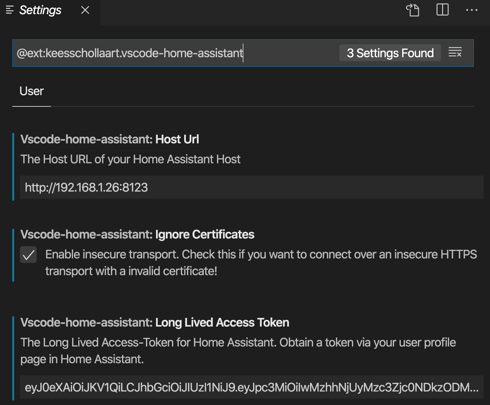

# SETUP

- [Intital Setup](#intital-setup)
- [Add-ons](#add-ons)
  - [Installing an add-on](#installing-an-add-on)
  - [Essentials: Management](#essentials-management)
- [Code Editing](#code-editing)

## Intital Setup
Once the install has completed:
- Screen 1: Create an account
- Screen 2: Click "Detect" and set your time zone and unit system
- Screen 3: Click Finish and then click "Save Login"

- Then click Supervisor | System| Reboot

## Add-ons

[Add-ons](https://www.home-assistant.io/addons/) are like apps in a Home Assistant App Store.  From running Pi-hole to Plex, add-ons provide a nice, easy way to extend the functionality of your hub.

### Installing an add-on

1. Select Supervisor | Add-on Store from your Home Assistant instance.
2. If your desired add-on does NOT come from the default repositories, paste your add-on's repository link in the "Add new repository by URL" and click Add.
3. Click on your desired add-on 
4. Read and follow the add-on instructions (some have no instructions, others do)
5. Click install

### Essentials: Management

These are my must have add-ons to manage your instance.  Install the following add-ons, setting usernames and passwords appropriately.

Add-on | Description
--|--
Samba share | Gives you direct Samba/SMB access to you instance's default shares
SSH & Web Terminal | Gives you SSH access (with optional web interface) to your instance

## Code Editing
We'll use Visual Studio Code as our Home Assistant code editor as it has several advantages:

- It's free
- Home Assistant extensions for VS Code add features like auto completion
- The editor can be run from your Home Assistant instance if running on an Intel NUC

1. Follow [these instructions](https://github.com/SeanPM5/homeassistant-config/wiki/Editing-Home-Assistant-in-Visual-Studio-Code) to install VS Code and relevant extensions
2. Open Home Asisstant, click on the circled user account icon (bottom left), and create a Long-lived access token
3. Open VS Code and configure the Home Assistant extension with the URL to your Home Assistant server and the long lived access token you just created.

***

[Previous](install-nuc.md) | [Next](gui.md) |
[Table of Contents](../README.md#table-of-contents)